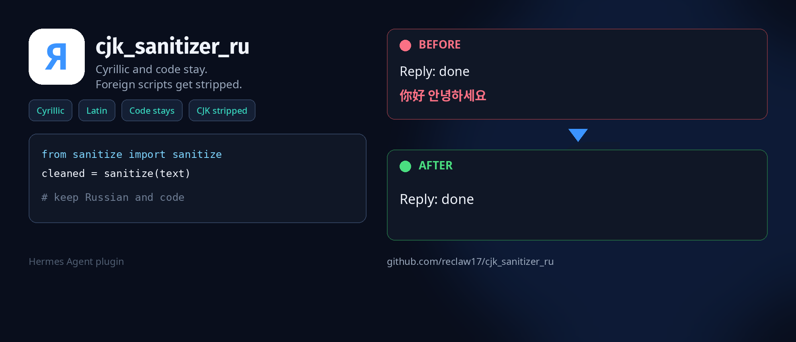

# CJK Sanitizer RU — Hermes plugin

<p>
  <a href="README.md"> Русский</a>
  &nbsp;·&nbsp;
   <strong>English</strong>
</p>

<p align="center">
  
</p>

[](LICENSE)
[](https://hermes-agent.nousresearch.com)

A [Hermes Agent](https://hermes-agent.nousresearch.com) plugin that drops CJK and other foreign-script leaks from the model’s final reply. Cyrillic, Latin, and markdown code stay.

Fork of [evanyudis/cjk_sanitizer](https://github.com/evanyudis/cjk_sanitizer). Upstream treats Cyrillic (`\u0400-\u04FF`) as the same junk as Chinese. Do not enable both: `transform_llm_output` keeps the first non-empty return.

## Why

MiniMax, DeepSeek, GLM, and Qwen sometimes splice ideographs — or other scripts — into a Russian or English answer. This plugin hooks `transform_llm_output` and cuts that locally. No second model call.

## Keep / strip

| Script | Behavior |
|--------|----------|
| Cyrillic (including Supplement and Extended) | kept |
| Latin, IPA | kept |
| Greek (π, α, Σ) and letterlike (ℝ) | kept |
| Digits, normal punctuation, guillemets, emoji, arrows, math symbols | kept |
| Fenced ` ``` ` and inline `` `...` `` | not touched |
| CJK (ideographs, radicals, extensions) | stripped |
| Hiragana, Katakana, Hangul | stripped (stricter than upstream) |
| Arabic, Hebrew, Devanagari, Thai, and other foreign letters | stripped |
| CJK punctuation (`。` `、`) | stripped |

Fullwidth ASCII in prose (`Ｕ`, `ｐ`) folds to regular ASCII. No global NFKC.

If **your** message already uses a script we would strip (studying Chinese, and so on), that turn is left alone. Upstream advertised this; this fork actually does it.

## Install

Requires [Hermes Agent](https://hermes-agent.nousresearch.com/docs/getting-started/installation).

```bash
hermes plugins install reclaw17/cjk_sanitizer_ru --enable
hermes gateway restart
hermes plugins list
```

You should see `cjk_sanitizer_ru`. Turn off catalog `cjk_sanitizer` if it is still enabled.

Manual install:

```bash
git clone https://github.com/reclaw17/cjk_sanitizer_ru.git ~/.hermes/plugins/cjk_sanitizer_ru
```

In `~/.hermes/config.yaml`:

```yaml
plugins:
  enabled:
    - cjk_sanitizer_ru
```

Update with `hermes plugins update cjk_sanitizer_ru`. Disable by removing it from `enabled` or adding it to `disabled`.

## How it works

1. `pre_llm_call` looks at `user_message`. If it contains a character this plugin would strip, sanitizing is skipped for the turn. Return `None` here — a string gets injected into the user message.
2. `transform_llm_output` returns `None` or the cleaned text.
3. In prose: fullwidth ASCII → ASCII, foreign letters and CJK punctuation go away, leftover spaces collapse.
4. Fenced and inline code are left as-is. Indented code without markdown fences is not detected in v1.

Logic is in `sanitize.py`. Hooks are registered in `__init__.py`. Stdlib only.

## Tests

```bash
python3 -m unittest tests.test_sanitize -v
```

## Out of scope

- Bad translations and hallucinations
- Configurable ranges in `plugin.yaml`
- Whole-text NFKC
- Leaks inside indented code that has no fences

## License

MIT. Original copyright [Evan Yudistira](https://github.com/evanyudis). This fork: `reclaw17/cjk_sanitizer_ru`. Not affiliated with Nous Research.
