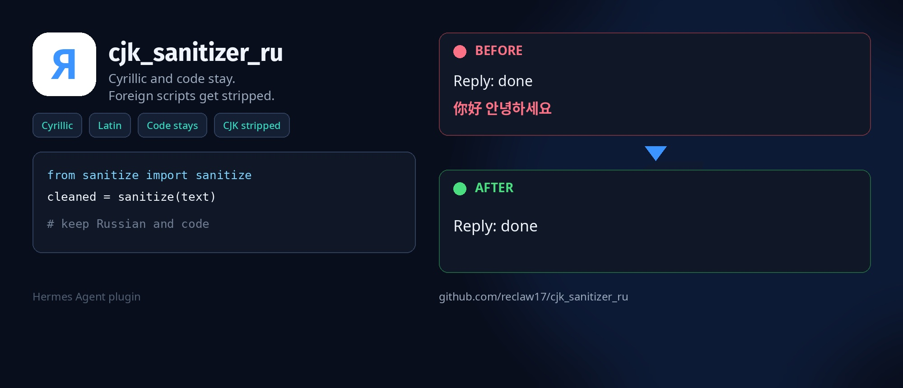

# CJK Sanitizer RU — Hermes plugin

<p>
  <a href="README.md"> Русский</a>
  &nbsp;·&nbsp;
   <strong>English</strong>
</p>

The Russian page is the primary one. This file is the English copy.

<p align="center">
  
</p>

[](LICENSE)
[](https://hermes-agent.nousresearch.com)

Fork of [evanyudis/cjk_sanitizer](https://github.com/evanyudis/cjk_sanitizer) for Russian chats.

Upstream strips both Chinese ideographs and Cyrillic from model output. Here Cyrillic, Latin, and code stay. CJK and other foreign scripts are removed before the reply reaches the terminal or chat.

## Why

Models such as MiniMax, DeepSeek, GLM, and Qwen sometimes leak ideographs (and other scripts) into a Russian or English answer. This plugin hooks `transform_llm_output` and cuts that without a second model call.

Do not enable the catalog `cjk_sanitizer` next to this one: that plugin treats `\u0400-\u04FF` as junk. `transform_llm_output` keeps the first non-empty return.

## Keep / strip

| Script | Behavior |
|--------|----------|
| Cyrillic (including Supplement and Extended) | kept |
| Latin, IPA | kept |
| Greek (π, α, Σ) and letterlike (ℝ) | kept |
| Digits, normal punctuation, guillemets, emoji, arrows, math symbols | kept |
| Fenced ` ``` ` and inline `` `...` `` | not touched |
| CJK (ideographs, radicals, extensions) | stripped |
| Hiragana, Katakana, Hangul | stripped (stricter than upstream) |
| Arabic, Hebrew, Devanagari, Thai, and other foreign letters | stripped |
| CJK punctuation (`。` `、`) | stripped |

Fullwidth ASCII (`Ｕ`, `ｐ`) in prose is folded to regular ASCII. No global NFKC.

If **your** message already uses a foreign script (learning Chinese, etc.), that turn is left alone. Upstream promised this in the README; this fork implements it.

## Install

Needs [Hermes Agent](https://hermes-agent.nousresearch.com/docs/getting-started/installation).

```bash
hermes plugins install reclaw17/cjk_sanitizer_ru --enable
hermes gateway restart
hermes plugins list
```

You should see `cjk_sanitizer_ru`. Disable catalog `cjk_sanitizer` if it is still on.

Manual:

```bash
git clone https://github.com/reclaw17/cjk_sanitizer_ru.git ~/.hermes/plugins/cjk_sanitizer_ru
```

In `~/.hermes/config.yaml`:

```yaml
plugins:
  enabled:
    - cjk_sanitizer_ru
```

Update: `hermes plugins update cjk_sanitizer_ru`.

To disable: drop it from `enabled` or add it to `disabled`.

## How it works

1. `pre_llm_call` inspects `user_message`. If it contains a character this plugin would strip, the turn is skipped. The hook must return `None` or Hermes injects the return into the user message.
2. `transform_llm_output` returns `None` or the cleaned text.
3. In prose: fullwidth ASCII → ASCII, foreign letters and CJK punctuation go away, extra spaces collapse.
4. Fenced and inline code are left as-is. Indented code without markdown fences is not detected in v1.

Logic lives in `sanitize.py`, hooks in `__init__.py`. Stdlib only.

## Tests

```bash
python3 -m unittest tests.test_sanitize -v
```

## Out of scope

- Translation quality and hallucinations
- Configurable ranges in `plugin.yaml`
- Whole-text NFKC
- Leaks inside indented code without fences

## License

MIT. Original copyright [Evan Yudistira](https://github.com/evanyudis). Russian-oriented fork: `reclaw17/cjk_sanitizer_ru`. Not affiliated with Nous Research.
