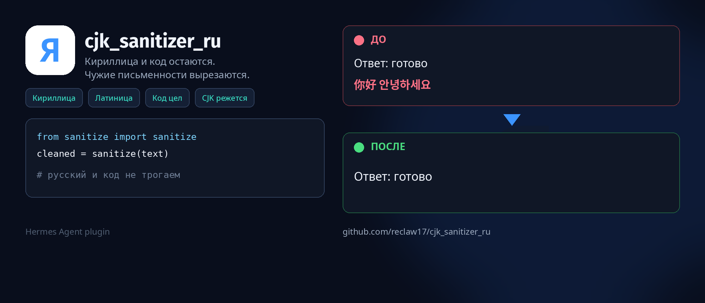

# CJK Sanitizer RU — плагин Hermes

<p>
   <strong>Русский</strong>
  &nbsp;·&nbsp;
  <a href="README.en.md"> English</a>
</p>

<p align="center">
  
</p>

[](LICENSE)
[](https://hermes-agent.nousresearch.com)

Форк [evanyudis/cjk_sanitizer](https://github.com/evanyudis/cjk_sanitizer) под русский чат.

Апстрим вырезает из ответа модели и китайские иероглифы, и кириллицу. Здесь кириллица, латиница и код остаются. CJK и другие чужие письменности убираются до того, как ответ попадёт в терминал или чат.

## Зачем

Модели вроде MiniMax, DeepSeek, GLM, Qwen иногда подмешивают иероглифы (и не только) в середину русского или английского ответа. Плагин вешается на `transform_llm_output` и срезает это без второго вызова модели.

Каталожный `cjk_sanitizer` для русского не подходит: `\u0400-\u04FF` у него в том же паттерне, что и CJK. Не включайте оба сразу — у хука побеждает первый непустой return.

## Что остаётся / что режется

| Письменность | Поведение |
|--------------|-----------|
| Кириллица (включая Supplement и Extended) | остаётся |
| Латиница, IPA | остаётся |
| Греческий (π, α, Σ) и letterlike (ℝ) | остаётся |
| Цифры, обычная пунктуация, «ёлочки», эмодзи, стрелки, матсимволы | остаётся |
| Код в ` ``` ` и inline `` `...` `` | не чистится |
| CJK (иероглифы, радикалы, расширения) | режется |
| Хирагана, катакана, хангыль | режется (жёстче апстрима) |
| Арабский, иврит, деванагари, тайский и прочие чужие буквы | режется |
| CJK-пунктуация (`。` `、`) | режется |

Полновидная ASCII (`Ｕ`, `ｐ`) в прозе сводится к обычной. Глобальный NFKC не применяется.

Если в **твоём** сообщении уже есть чужая письменность (учишь китайский и т.п.), этот ход не чистится. В апстриме это было в README, в коде — нет.

## Установка

Нужен установленный [Hermes Agent](https://hermes-agent.nousresearch.com/docs/getting-started/installation).

```bash
hermes plugins install reclaw17/cjk_sanitizer_ru --enable
hermes gateway restart
hermes plugins list
```

В списке должен быть `cjk_sanitizer_ru`. Если рядом висит каталожный `cjk_sanitizer` — выключи его.

Вручную:

```bash
git clone https://github.com/reclaw17/cjk_sanitizer_ru.git ~/.hermes/plugins/cjk_sanitizer_ru
```

В `~/.hermes/config.yaml`:

```yaml
plugins:
  enabled:
    - cjk_sanitizer_ru
```

Обновление: `hermes plugins update cjk_sanitizer_ru`.

Временно выключить — убрать из `enabled` или добавить в `disabled`.

## Как устроено

1. `pre_llm_call` смотрит `user_message`. Если там есть символ, который плагин режет — на этот ход ставится skip. Хук возвращает `None`, иначе Hermes допишет строку в сообщение пользователя.
2. `transform_llm_output` либо ничего не делает (`None`), либо возвращает очищенный текст.
3. В прозе: полновидная ASCII → обычная, чужие буквы и CJK-пунктуация вырезаются, лишние пробелы схлопываются.
4. Fenced- и inline-код не трогаются. Код с отступами без markdown-заборов в v1 не распознаётся.

Логика в `sanitize.py`, хуки в `__init__.py`. Зависимостей кроме stdlib нет.

## Проверка

```bash
python3 -m unittest tests.test_sanitize -v
```

## Чего плагин не делает

- Не чинит перевод и галлюцинации.
- Не настраивает диапазоны через `plugin.yaml`.
- Не нормализует весь текст NFKC.
- Не выключает утечки внутри indented-кода без \`\`\`.

## Лицензия

MIT. Исходный копирайт — [Evan Yudistira](https://github.com/evanyudis). Переработка под русский — форк `reclaw17/cjk_sanitizer_ru`. Не связан с Nous Research.
